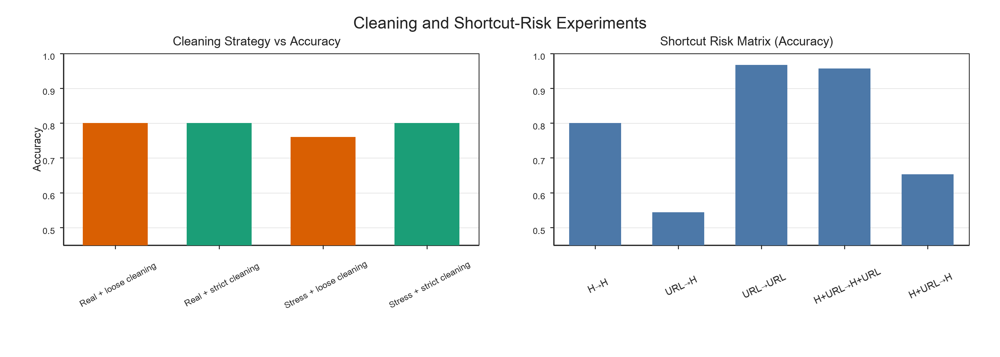

# News Headline Classification and Shortcut Learning

**CIS 4190/5190 Applied Machine Learning · University of Pennsylvania · Spring 2026**  
**Team:** Yingyu Ma, Jiheng Hou, Mingang Guo · **Portfolio edition:** Yingyu Ma

A headline classifier can score well by recognizing a publisher's URL structure without learning useful patterns in the headline itself. This team project studies that failure mode while developing a classifier for Fox News and NBC News headlines.

[Read the project report](project-report.pdf) · [Explore the results](results.md) · [Project team](CONTRIBUTIONS.md) · [Original repository](https://github.com/Anthoneeee/ember-text-notes) · [Dataset on Hugging Face](https://huggingface.co/datasets/Anthoneeee/cis5190-project-b-news-headlines)

## Research question

**Does strong validation performance reflect headline understanding, or reliance on source-revealing shortcuts?**

We compare headline-only, URL-only, and combined representations, including evaluation when the URL signal is removed. The final submitted classifier uses headline text; URLs serve as retrieval handles and data provenance.

## Main findings

- **87.42% recorded course leaderboard accuracy** for the final ensemble. This is the team's reported result; the private course evaluation set is not included here.
- A URL-trained model achieved **96.71%** when tested on URL representations, but **54.40%** when tested on actual headlines.
- A model trained on headlines plus URLs fell from **95.66% to 65.31%** when URL features were unavailable at inference.
- In an injected conflicting-duplicate stress test, strict cleaning improved validation accuracy from **75.95% to 80.03%**. Cleaning made no measurable difference on the already-clean base split.

These comparisons show sensitivity to the input interface. They support keeping evaluation aligned with the intended headline-only task; they do not establish that all topic or publisher biases have been removed.



The figure and experiment table are preserved from the team project. Full results and evaluation distinctions are in [results.md](results.md).

## Approach

1. Recover headlines from the starter URLs and clean duplicate, invalid, and URL-derived fallback text.
2. Train sparse text baselines with word or character TF-IDF and logistic regression.
3. Investigate shortcut reliance through controlled input-representation comparisons.
4. Build a headline-only ensemble with complementary classifiers and calibrate its decision threshold.

The final checkpoint uses a heterogeneous ensemble, including TF-IDF/logistic-regression branches, Complement Naive Bayes, and calibrated SGD. The two training scripts in this repository reproduce the single-model baselines; they do not recreate the complete final ensemble search.

## My contribution

I contributed to classifier implementation, headline data preparation and cleaning, and model training. I also led the writing and organization of the project report, synthesizing the team's methods, experiments, and findings.

This repository brings together the project report, dataset, baseline training scripts, experimental results, and a command-line interface for the final model.

## Run the project

Python 3.11 is recommended. Start from the repository root.

### Reproduce a baseline

```bash
python -m venv .venv
source .venv/bin/activate
python -m pip install -r baseline-requirements.txt
python train_word_baseline.py --input-csv headlines.csv --output-model artifacts/word-baseline.joblib --no-final-retrain-on-full
python train_char_baseline.py --input-csv headlines.csv --output-model artifacts/char-baseline.joblib --no-final-retrain-on-full
```

The included CSV has **3,802 real-headline rows**. The historical word-baseline result in the report used the 3,803-row cleaned base variant; a rerun on this stricter CSV can differ. The default split is stratified, 80/20, with random seed 42. Exported model files are ignored by Git.

Both commands were verified on September 14, 2026: word-baseline accuracy was **79.37%** and character-baseline accuracy was **83.05%** on the included dataset.

### Use the submitted ensemble

```bash
python -m pip install -r requirements.txt
python download_model.py
python predict.py "Lawmakers debate a new infrastructure proposal"
```

`download_model.py` retrieves the original 39 MB checkpoint from a fixed upstream commit and verifies its SHA-256 checksum before installing it as `model.pt`. The checkpoint is kept in the original public repository so this presentation repository stays small. The historical format contains serialized Python/scikit-learn objects; use the pinned, verified project artifact.

Predictions use the course label convention: `0 = Fox News`, `1 = NBC News`. The example is a software demonstration, not a reliable attribution of an arbitrary headline. Missing or URL-only text passed directly to `predict.py` is rejected; the original `preprocess.py` also supports the course CSV interface.

## Files

| File | Purpose |
|---|---|
| `project-report.pdf` | Original full team report, including contributions and limitations |
| `results.md`, `shortcut-experiments.csv` | Reported results and evaluation context |
| `model.py`, `preprocess.py` | Original final-model wrapper and preprocessing |
| `news_b_utils.py` | Original baseline data preparation |
| `train_word_baseline.py`, `train_char_baseline.py` | Original baseline training scripts, renamed for clarity |
| `headlines.csv` | Cleaned 3,802-row headline-only dataset |
| `download_model.py`, `model-manifest.json` | Pinned checkpoint source and integrity information |
| `predict.py` | Added command-line entry point for inference |
| `PROVENANCE.md` | Sources, preservation notes, and reuse status |

## Limitations

Headlines can reflect topic distributions as well as writing style. Public-news data can drift over time, and web retrieval can fail. The final ensemble was selected using repeated course leaderboard feedback; its recorded score is not an estimate from an untouched external test set. Training-corpus checks must not be interpreted as held-out performance. This is an educational NLP project and has not been evaluated on clinical data.

## Attribution

Original code and experiment artifacts: [Anthoneeee/ember-text-notes](https://github.com/Anthoneeee/ember-text-notes), commit `1d3d4b5d8d4c5f200792944f21bb9feb50b6170d`. The original repository has no explicit license file; this portfolio edition does not assign a new license to the team's work. See [PROVENANCE.md](PROVENANCE.md).
